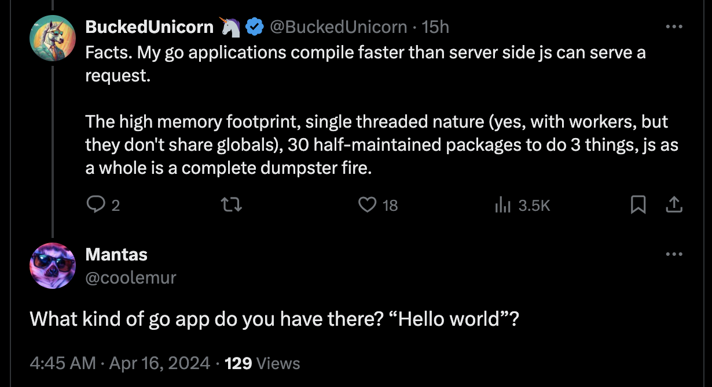
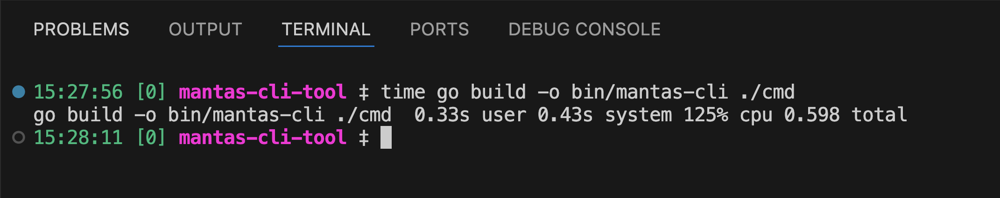

# Mantas-CLI-Tool: Proving Go's Lightning Speed 🚀

Welcome to the repository of `mantas-cli-tool`, a CLI application designed to put an end to a fiery debate on Twitter: can a complex Go application compile faster than a Node.js server can serve a web request? The answer is yes, and here's how we prove it.

## Why?

### Doubters



### Evidence



## What is Mantas-CLI-Tool?

`mantas-cli-tool` is not your average "Hello World" Go application. It's a robust command-line interface that performs file operations, pings servers, and displays system diagnostics—all while compiling faster than it takes to complain about JavaScript's performance on Twitter.

### Features

- **File Operations**: Create, read, update, delete files faster than you can type "callback hell."
- **Network Operations**: Ping servers and fetch URLs quicker than Node.js can load its `node_modules`.
- **System Diagnostics**: Check your system's memory and CPU load in less time than it takes for a JavaScript developer to find a new framework.

### Why Go?

- **Speed**: Go compiles to machine code, making it blazing fast. Perfect for winning Twitter arguments.
- **Simplicity**: Fewer lines of code, fewer dependencies. Unlike some ecosystems, we don’t need a package to parse JSON.
- **Concurrency**: Go's built-in support for concurrency is not just an afterthought. We handle multiple tasks at once without spinning up a new thread for each.

### Getting Started

Clone the repository and run the following command:

```bash
go build -o mantas-cli cmd/main.go
```

Yes, it compiles this fast. See it to believe it!

### Usage

Here's how you can utilize `mantas-cli-tool`:

```bash
./mantas-cli -file read example.txt
./mantas-cli -net ping example.com
./mantas-cli -sys cpu
```

### Compilation Time

Don't blink—you might miss it. Our tests show that `mantas-cli-tool` compiles faster than the average time it takes for a Node.js server to respond to a simple HTTP request. Don't believe us? Try it out yourself.

### Contributing

Feel free to fork, star, and contribute! If you find a way to make this tool compile even faster, or if you want to add more features just to further embarrass slower technologies, pull requests are welcome.
